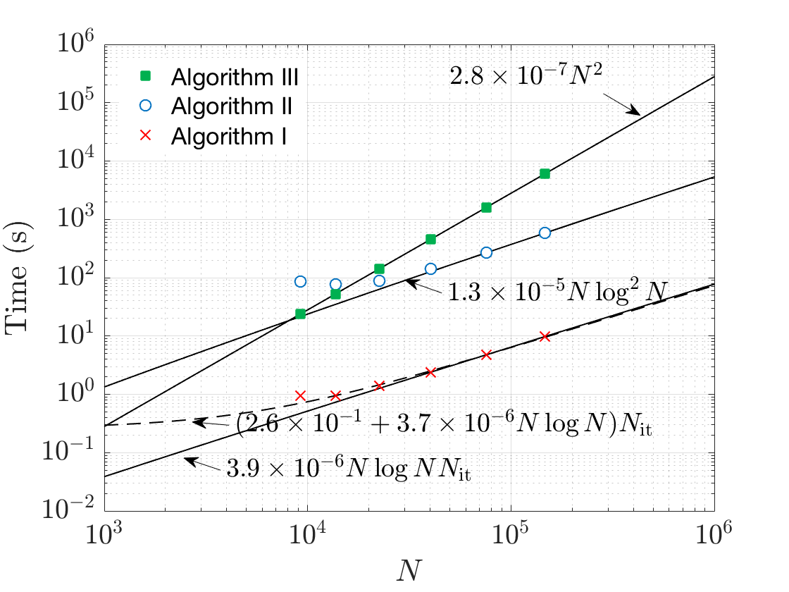

# scalingplots
Matlab subroutines for scaling plots
Fits curve of the form N^p log^q N to the given timing data

Syntax, Inputs, and Outputs are described inside of the .m files

main.m provides a sample script that uses all the available subroutines.

